# Lab 2 – Flat XML Layouts & ViewBinding

- **Student:** Kiều Bảo Giang – **Student ID:** 2474802010095
- **Course:** Mobile Programming
- **Package:** `vn.edu.vlu.lab2` · Kotlin · minSdk 24 · targetSdk 37

The app has two screens, **Sign in** and **User Profile**, built entirely with a flat
`ConstraintLayout` and accessed through **ViewBinding** (no `findViewById`).

## Screenshots

All screenshots were taken on the **Small_Phone** AVD (720×1280, 360×640dp, Android 17).
The large phone and tablet sizes were simulated on the same AVD with `adb shell wm size` / `wm density`.

| Sign in | Profile |
|---|---|
| 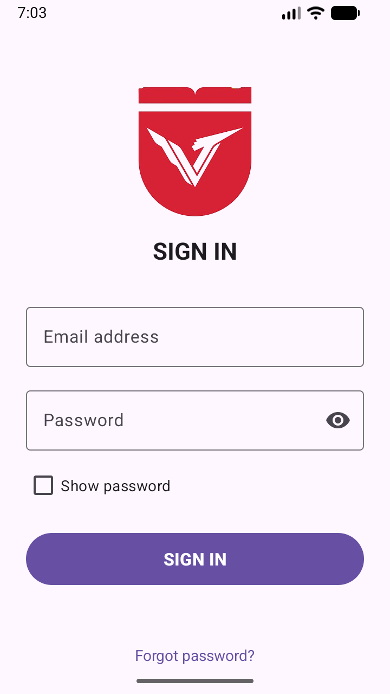 | 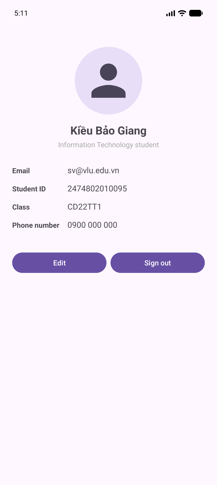 |

| Sign in – landscape | Profile – landscape |
|---|---|
| 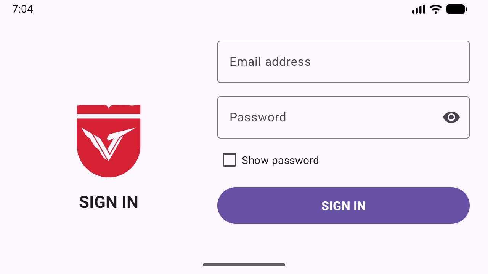 | 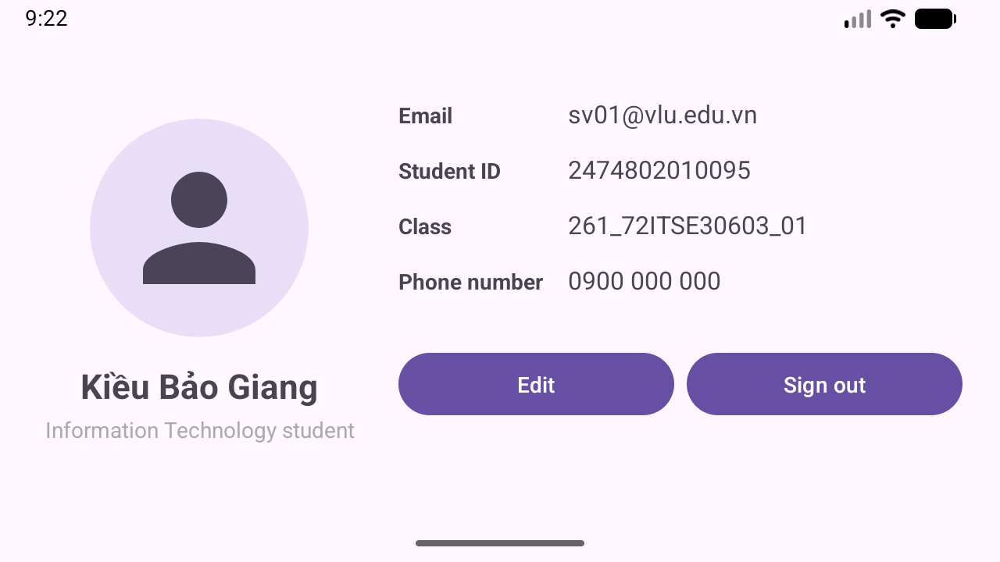 |

### Layout Inspector

The Profile screen in Android Studio's Layout Inspector: the Component Tree shows every View as a direct
child of the single `ConstraintLayout` (flat hierarchy), and Attributes shows the selected View's real position and size in dp.

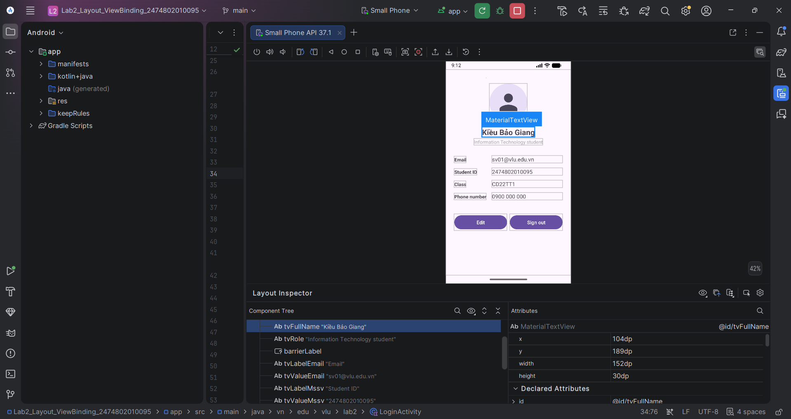

## Requirements

| ID | Requirement | Implementation |
|---|---|---|
| R1 | Logo, title, Email, Password, Sign in button, status line | `res/layout/activity_login.xml` – vertical constraint chain `imgLogo → tvTitle → tilEmail → tilPassword → cbShowPassword → btnLogin → tvStatus → tvForgotPassword` |
| R2 | Empty fields / invalid email / password shorter than 6 characters | `LoginActivity.handleLogin()` uses `when`; errors appear right under the field (`TextInputLayout.error`) |
| R3 | Valid sign-in ⇒ “Signed in successfully: &lt;email&gt;” | Mock authentication, then opens `ProfileActivity` and passes the email through an `Intent` |
| R4 | Round 1:1 avatar, name, role, label \| value rows, 2 evenly split buttons | `res/layout/activity_profile.xml` – `ShapeableImageView` + `dimensionRatio 1:1` + `width_percent 0.35`, horizontal chain `spread` + `weight 1` |
| R5 | Flat ConstraintLayout + ViewBinding, strings in `strings.xml` | `buildFeatures { viewBinding = true }`, no `findViewById`, no hardcoded strings |
| R6 | Submit via a public GitHub repository | Repository `Lab2_Layout_ViewBinding_2474802010095` |

## Practice exercises

**Level 1**
- [x] A centered “Forgot password?” line below `tvStatus` that shows a Toast when tapped.
- [x] All strings live in `strings.xml`. English is the default (`res/values`), with a Vietnamese translation in `res/values-vi`.

**Level 2**
- [x] `res/layout-land/activity_login.xml`: vertical Guideline at 40%, logo + title on the left, form on the right.
  Also `res/layout-land/activity_profile.xml` (avatar on the left, details on the right).
- [x] A “Show password” CheckBox that switches the `transformationMethod` of `edtPassword`.
- [x] A “Phone number” row on the Profile; a `Barrier` keeps the value column after the longest label.

**Level 3**
- [x] Material 3 `TextInputLayout` + `TextInputEditText`, with an eye icon for the password (`app:endIconMode="password_toggle"`).
- [x] Layouts are wrapped in a `ScrollView`; since the app runs edge-to-edge, `WindowInsets.kt` leaves room for the system bars **and the keyboard**, so the form is never covered while typing.
- [x] `res/layout-sw600dp/activity_login.xml`: the form is at most 400dp wide (`layout_constraintWidth_max`) and centered.
  `res/layout-sw600dp/activity_profile.xml` keeps the profile details between two Guidelines (20% / 80%).

## Project structure

```
app/src/main/
├── java/vn/edu/vlu/lab2/
│   ├── LoginActivity.kt        # ViewBinding + input validation + navigation
│   ├── ProfileActivity.kt      # receives the email via Intent, Sign out = finish()
│   └── WindowInsets.kt         # padding for status bar / navigation bar / keyboard
└── res/
    ├── drawable-nodpi/ic_logo.png  # VLU logo
    ├── layout/                 # phone, portrait
    ├── layout-land/            # phone, landscape
    ├── layout-sw600dp/         # tablet
    ├── values/strings.xml      # English (default)
    └── values-vi/strings.xml   # Vietnamese
```

## Testing

The four cases from section 7.1 of the lab:

| Empty fields | Invalid email (`abc`) | Short password (`123`) | Valid (`sv01@vlu.edu.vn` / `123456`) |
|---|---|---|---|
| 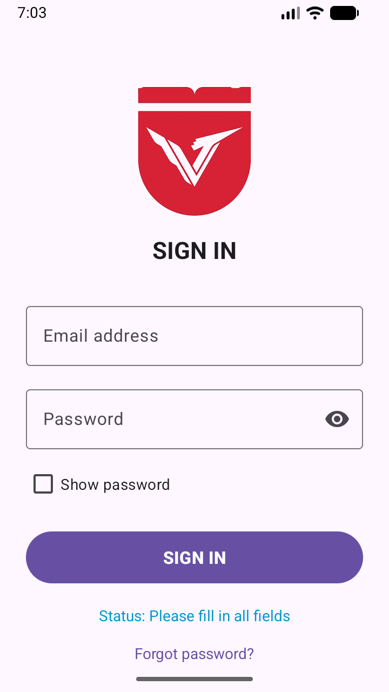 | 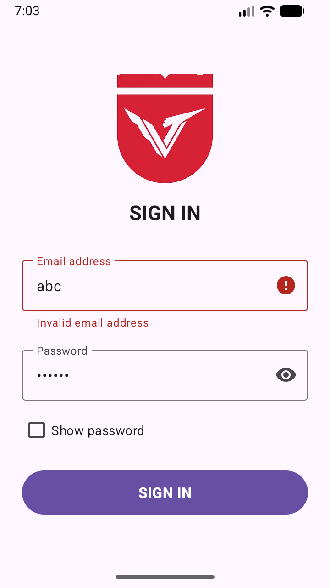 | 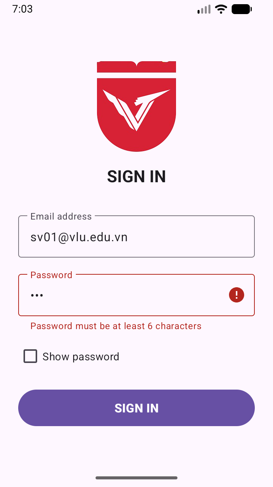 | 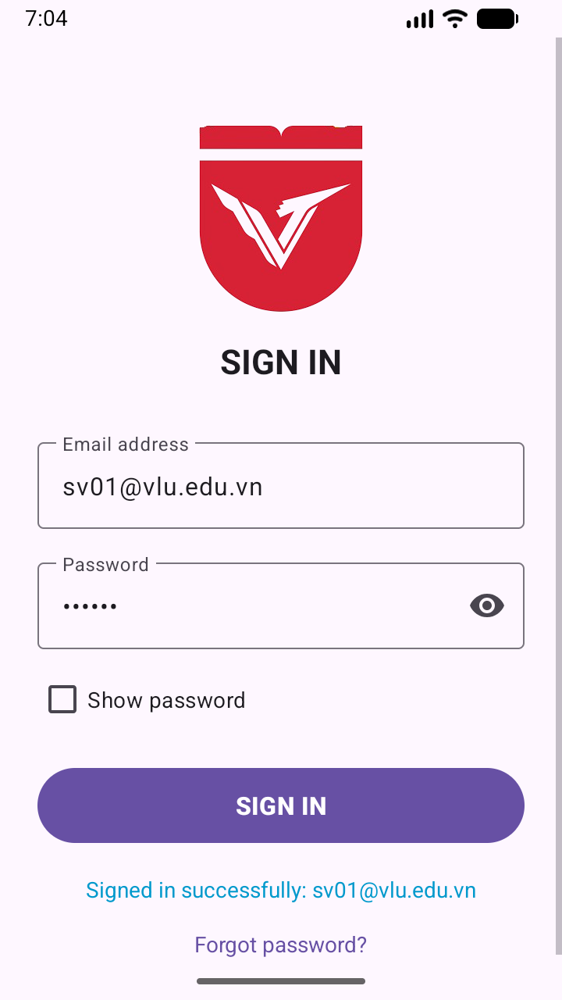 |
| “Status: Please fill in all fields” + Toast | “Invalid email address” under Email | “Password must be at least 6 characters” | “Signed in successfully: sv01@vlu.edu.vn”, then Profile opens |

The valid case opens the Profile screen; the last screenshot was taken after pressing Back, so the success status is visible.

### Responsive test matrix (section 5.6)

| Case | How | Sign in | Profile |
|---|---|---|---|
| Small phone | Small_Phone AVD, 360×640dp |  |  |
| Large phone | Pixel 8 Pro size, 1344×2992 @ 480dpi | 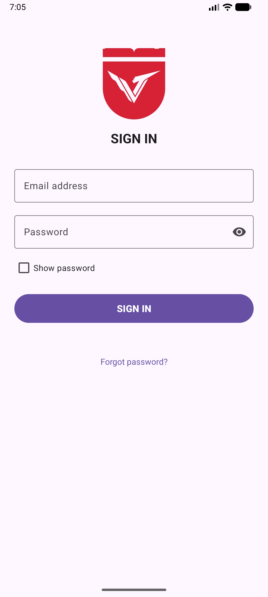 | 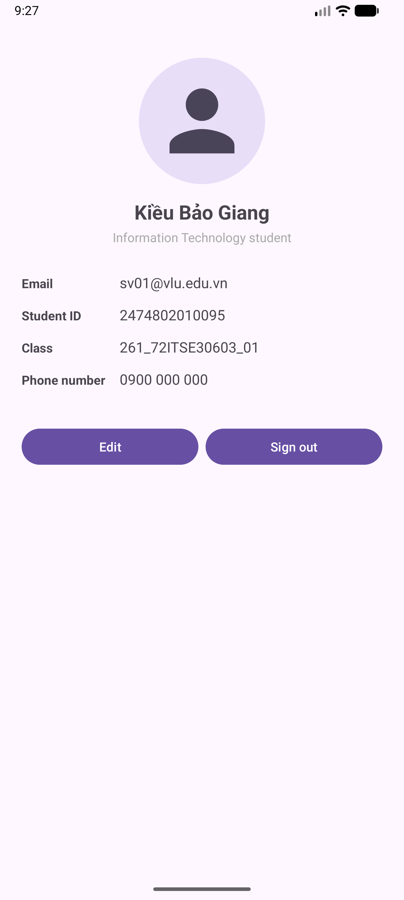 |
| Landscape | Rotated (`layout-land`) |  |  |
| Tablet | Pixel Tablet size, 1600×2560 @ 320dpi (`layout-sw600dp`) | 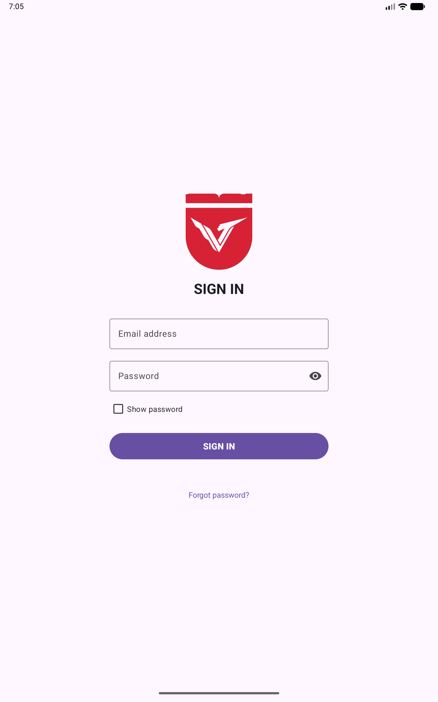 | 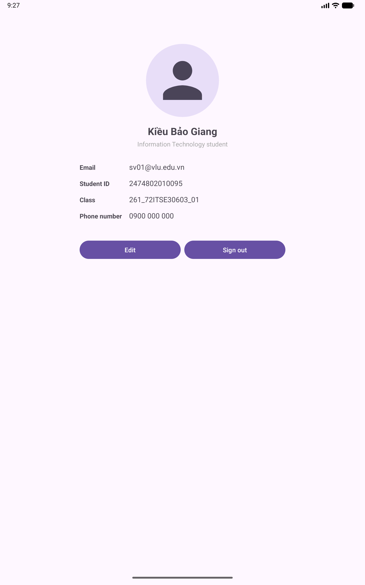 |
| Largest font | Font scale 2.0 | 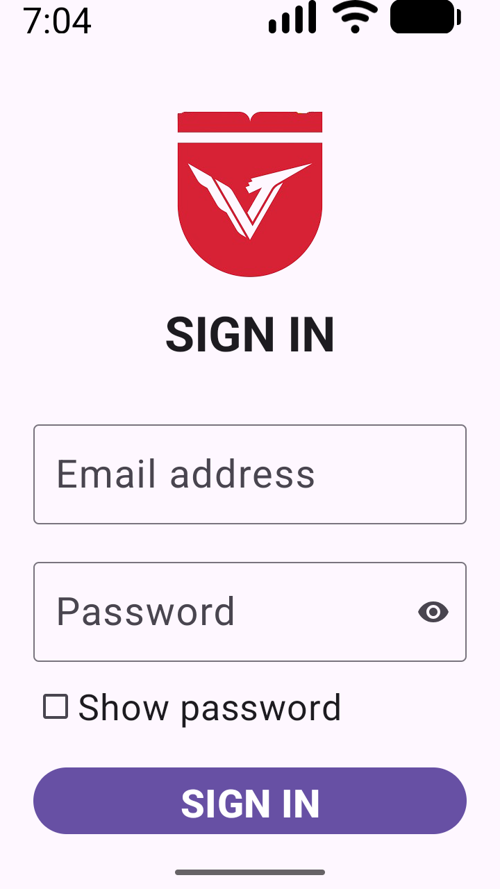 | 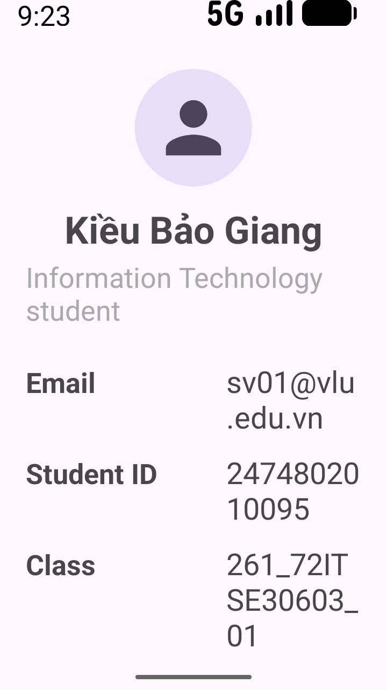 |

Results: nothing overflows or overlaps; in landscape and with the largest font the screens scroll, so the
**SIGN IN** button stays reachable; on the tablet the form is capped at 400dp and the profile is kept in a centered column.

## Running the project

1. Open the folder in Android Studio and wait for Gradle Sync.
2. Pick an AVD and press **Run** (or `./gradlew assembleDebug`).
